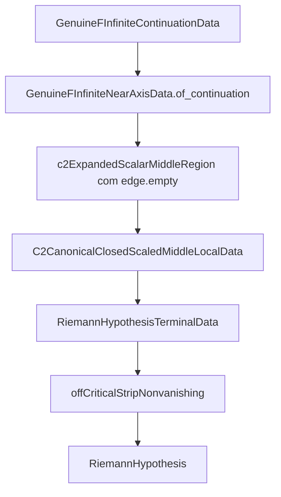

# Mapa da rota principal da prova

Escopo: este arquivo complementa `MAPA_TEOREMAS_RH.md` e `MAPA_TEOREMAS_RH_CURTO.md`.
Os outros mapas listam teoremas; este aqui separa a rota principal vigente, os pacotes de bounds/witnesses e as ramificacoes que hoje sao opcionais ou historicas.

## Resumo executivo

Hoje a rota principal recomendada e:

1. `GenuineFInfiniteContinuationData` em `LeanC2/Analytic/GenuineContinuation.lean`
2. `GenuineFInfiniteNearAxisData.of_continuation` em `LeanC2/Analytic/GenuineG11.lean`
3. faixa media concreta em `LeanC2/Analytic/GenuineBulkConcrete.lean`
4. witness local canonico `C2CanonicalClosedScaledMiddleLocalData`
5. `offCriticalStripNonvanishing_of_canonicalClosedScaledMiddleLocalData`
6. `mathlibRiemannHypothesis_of_offCriticalStripNonvanishing`

Ponto importante: a rota atual nao precisa de `edge` nao-trivial. O `edge` usado na pratica e
`C2OddTailContinuedBalancingSeedBulkModelEdgeData.empty`.

## Arquivos que realmente carregam a rota

| Camada | Arquivo | O que procurar |
| --- | --- | --- |
| Endpoint final | `LeanC2/Foundations/Basic.lean` | `mathlibRiemannHypothesis_of_offCriticalStripNonvanishing` |
| Transferencia final | `LeanC2/Route/Transfer.lean` | `FundamentalIdentityOnRightHalfPlane`, `mathlibRiemannHypothesis_of_F_nonvanishing`, `mathlibRiemannHypothesis_of_F_nonvanishing_offCriticalIdentity` |
| Casca abstrata da rota | `LeanC2/Roadmap.lean` | `NearAxisRouteData`, `RegionalVerticalBulkBoundsData`, `EdgeRouteData`, `OffCriticalCoverData`, `GenuineRouteData` |
| Continuacao | `LeanC2/Analytic/GenuineContinuation.lean` | `GenuineFInfiniteContinuationData`, `...fundamentalIdentity`, `...eq_continuedCentralOddChannel_on_punctured` |
| Near-axis atual | `LeanC2/Analytic/GenuineG11.lean` | `eventually_ne_zero_of_continuation`, `GenuineFInfiniteNearAxisData.of_continuation` |
| Certificado near-axis | `LeanC2/Route/NearAxis.lean` e `LeanC2/Route/NearAxisTaylor.lean` | `NearAxisCertificate`, `NearAxisCertificate.of_eventually_ne_zero`, `NearAxisCertificate.of_leibnizJet_c0` |
| Glue near/bulk/edge | `LeanC2/Analytic/GenuineCover.lean` | `GenuineFInfiniteNearBulkEdgeData`, `...toOffCriticalCoverData` |
| Bulk regional abstrato | `LeanC2/Analytic/GenuineBulk.lean` | wrappers `...regionalBulkCover` e `...regionalBulkBoundsCover` |
| Bulk concreto e endpoints terminais | `LeanC2/Analytic/GenuineBulkConcrete.lean` | quase toda a superficie concreta da prova atual |

## Como ler `GenuineBulkConcrete.lean`

Esse arquivo concentra quase tudo o que parece "grande demais" hoje. A melhor maneira de ler e por familias.

### 1. Entradas mais honestas para trabalhar na prova

- Se voce quer a formulacao principal mais direta: `mathlibRiemannHypothesis_of_continuationAndExpandedScalarMiddleSeparatedMainBounds`.
- Se voce quer a mesma rota com menos parametros livres: `mathlibRiemannHypothesis_of_continuationAndCanonicalClosedScaledMiddleSeparatedBounds`.
- Se voce ja consegue produzir o witness ponto a ponto na interface canonica: `mathlibRiemannHypothesis_of_continuationAndMiddleLocal`.
- Se voce quer empacotar tudo num objeto unico terminal: `RiemannHypothesisTerminalData`.

Leitura recomendada dentro do arquivo:

1. `C2OddTailContinuedBalancingSeedBulkModelEdgeData.empty`
2. `C2ExpandedScalarScaleData`
3. `C2ExpandedHorizontalLayerBudget`
4. `C2ExpandedSeedScaledBound`
5. `C2ExpandedCutoffScaledBound`
6. `C2ExpandedQuartetDominance`
7. `C2ExpandedScalarMainInequalities`
8. `C2ExpandedScalarLocalBulkData`
9. `C2CanonicalClosedScaledLocalData`
10. `C2CanonicalClosedScaledMiddleLocalData`
11. `RiemannHypothesisTerminalData`
12. `mathlibRiemannHypothesis_of_continuationAndExpandedScalarMiddleSeparatedMainBounds`

### 2. Convencao de nomes nesse arquivo

- `...LocalData`: witness ponto a ponto em um `s`.
- `...MiddleRegionData`: pacote regional sobre toda a `c2ExpandedScalarMiddleRegion`.
- `...CoverData`: pacote global near/bulk/edge para cobrir o `offCriticalStrip`.

Na rota principal atual, o alvo mais util costuma ser `...MiddleLocalData`, porque ele ja esta no formato minimo que fecha o pacote terminal.

### 3. Pacotes de bounds/witnesses da faixa media

Todos os itens abaixo ficam em `LeanC2/Analytic/GenuineBulkConcrete.lean`.

| Familia | Papel |
| --- | --- |
| `C2ExpandedScalarScaleData` | positividade/escala geometrica da formulacao expandida |
| `C2ExpandedHorizontalLayerBudget` | budget horizontal da camada off-axis |
| `C2ExpandedSeedScaledBound` | bound da seed escalada |
| `C2ExpandedCutoffScaledBound` | bound do cutoff escalado |
| `C2ExpandedQuartetDominance` | desigualdade principal de dominancia do quarteto |
| `C2ExpandedScalarMainInequalities` | pacote `hseed + hcutoff + hdominance` |
| `C2ExpandedScalarLocalBulkData` | witness local completo da rota expandida |
| `C2CanonicalClosedScaledLocalData` | compressao canonica do witness local |
| `C2CanonicalClosedScaledVerticalBudgetLocalData` | mesma rota canonica, mas recebendo budget vertical externo |
| `C2CanonicalClosedScaledVerticalTruncationLocalData` | rota canonica separando vertical e truncacao horizontal |
| `C2CanonicalClosedScaledResidualBudgetLocalData` | rota residual em budgets separados `tilt/horizontal/cutoff` |
| `C2QuartetComponentTruncationLocalData` | variante pela decomposicao `quartetComponent` |
| `C2QuartetComponentResolventNoteLocalData` | variante no formato mais proximo da nota do resolvente |
| `C2AntiMiracleGenuineCentralLocalData` | variante anti-milagre empacotada pelo bound central genuino |

### 4. Pacotes regionais e terminais

Tambem em `LeanC2/Analytic/GenuineBulkConcrete.lean`:

| Estrutura | Uso |
| --- | --- |
| `C2ExpandedScalarMiddleRegionData` | versao regional da rota expandida |
| `C2CanonicalClosedScaledCoverData` | cover completo near/bulk/edge na rota canonica |
| `C2CanonicalClosedScaledMiddleRegionData` | pacote regional nas estimativas canonicamente fechadas |
| `C2CanonicalClosedScaledMiddleLocalData` | pacote regional nas obrigacoes locais minimas |
| `RiemannHypothesisTerminalData` | objeto final que entrega RH sem mais plumbing |

## Onde moram os bounds de base

Os bounds concretos da faixa media nao nascem todos em `GenuineBulkConcrete.lean`. Os arquivos abaixo sao a base tecnica que ele reaproveita.

| Arquivo | Conteudo principal |
| --- | --- |
| `LeanC2/Operators/VerticalResolvent.lean` | `q`, `geom_resolvent`, `verticalDepthTailUpper`, `resolvent_lower_bound`, `verticalQuartetPrefix` |
| `LeanC2/Route/Dominance.lean` | lema abstrato de dominancia: `no_zero_of_dominance`, `no_zero_of_resolvent_dominance` |
| `LeanC2/Route/BulkReal.lean` | margem e regiao analitica basica: `c2AnalyticBulkMargin`, `c2AnalyticBulkRegion` |
| `LeanC2/Route/BulkErrors.lean` | envelopes `G/E`: `c2BulkGUpper`, `c2BulkEUpper`, `c2BulkErrorMargin` |
| `LeanC2/Route/BulkQuartet.lean` | quarteto vertical e regioes de erro: `c2QuartetVerticalTailUpper`, `c2QuartetAnalyticBulkRegion` |
| `LeanC2/Route/BulkHorizontal.lean` | budgets horizontais regularizados |
| `LeanC2/Route/BulkTilt.lean` | bounds de tilt, variantes truncadas, geometricas e analiticas |
| `LeanC2/Route/BulkCutoff.lean` | upper bounds do cutoff em funcao da escala |
| `LeanC2/Route/BulkOddTail.lean` | bounds da odd tail e versoes seeded/escaladas |
| `LeanC2/Route/BulkEstimates.lean` | pacote combinado de estimativas escalares |
| `LeanC2/Route/BulkConcrete.lean` | witnesses oscilatorios concretos para o cutoff/exponencial |
| `LeanC2/Route/BulkAntiMiracleTilt.lean` | interface abstrata da rota anti-milagre no nivel do roadmap |
| `LeanC2/Route/VerticalBulkReal.lean` | pacote pronto da rota vertical-resolvent no nivel `RegionalVerticalBulkBoundsData` |

## O que hoje e rota principal e o que e ramificacao opcional

### Rota principal atual

- `continuation -> near-axis por continuation -> middle local canonico -> transfer -> RH`
- `edge` vazio via `C2OddTailContinuedBalancingSeedBulkModelEdgeData.empty`
- alvo de trabalho mais honesto: `mathlibRiemannHypothesis_of_continuationAndExpandedScalarMiddleSeparatedMainBounds`
- compressao preferida quando voce quer menos parametros: `mathlibRiemannHypothesis_of_continuationAndCanonicalClosedScaledMiddleSeparatedBounds`

### Ramificacoes que existem, mas nao sao obrigatorias para seguir a rota principal

- familia `quartetExact`, `quartetTriangle`, `quartetClosed`, `quartetComponent`
- familia `canonicalClosedScaled` residual por `majorant`, `verticalBudget`, `verticalTruncation`
- familia `quartetComponentResolventNote...`, que e a versao mais fiel ao formato da nota do resolvente
- familia `AntiMiracle...`, incluindo residual, central-defect, oscillatory e exponential witness
- wrappers de `concreteCover`, `subsetCover`, `expandedScalarCover`, que sao uteis para cobertura global mas nao sao a entrada mais limpa para a prova analitica restante

### Rota que o proprio Lean ja marcou como nao-terminal

Existe uma rota totalmente explicita baseada em `c2CanonicalClosedScaledResidualFiniteExactZetaUpper`, mas ela nao deve ser tratada como alvo terminal atual.

Os bloqueios formais estao no mesmo `LeanC2/Analytic/GenuineBulkConcrete.lean`:

- `c2ExpandedQuartetResidualMargin_lt_scaledVerticalDepthTail_of_offCriticalStrip`
- `c2AnalyticBulkAllowance_sub_reserve_lt_scaledVerticalDepthTail_of_offCriticalStrip`
- `not_c2CanonicalClosedScaledResidualFiniteExactZetaUpper_lt_analyticResidual_of_offCriticalStrip`

Traducao pratica: a rota residual totalmente explicita ficou formalmente obstruida, entao o trabalho restante honesto esta em witnesses medios menos grosseiros, nao em insistir nessa desigualdade final.

## O que pode ser ignorado se o foco for so a rota principal

- qualquer `edge` diferente de `C2OddTailContinuedBalancingSeedBulkModelEdgeData.empty`
- wrappers antigos de `cover` se o seu subalvo atual e apenas a faixa media
- rotas `AntiMiracle` e `ResolventNote` se voce nao estiver deliberadamente trabalhando nessas formulacoes
- a rota residual `FiniteExactZeta` totalmente explicita, porque ela ja esta bloqueada no proprio Lean

## Receitas de navegacao

### Se voce quer entender o fechamento final

1. `LeanC2/Analytic/GenuineBulkConcrete.lean`: `RiemannHypothesisTerminalData`
2. `LeanC2/Route/Transfer.lean`
3. `LeanC2/Foundations/Basic.lean`

### Se voce quer preencher a prova restante da faixa media

1. `LeanC2/Analytic/GenuineBulkConcrete.lean`: `C2ExpandedScalarScaleData`
2. `LeanC2/Analytic/GenuineBulkConcrete.lean`: `C2ExpandedHorizontalLayerBudget`
3. `LeanC2/Analytic/GenuineBulkConcrete.lean`: `C2ExpandedScalarMainInequalities`
4. `LeanC2/Analytic/GenuineBulkConcrete.lean`: `C2CanonicalClosedScaledLocalData`
5. `LeanC2/Analytic/GenuineBulkConcrete.lean`: `mathlibRiemannHypothesis_of_continuationAndExpandedScalarMiddleSeparatedMainBounds`

### Se voce quer mexer so no near-axis

1. `LeanC2/Analytic/GenuineG11.lean`
2. `LeanC2/Route/NearAxisTaylor.lean`
3. `LeanC2/Route/NearAxis.lean`

### Se voce quer descobrir de onde veio um upper bound concreto

1. comece em `LeanC2/Analytic/GenuineBulkConcrete.lean`
2. identifique se o nome aponta para `tilt`, `horizontal`, `cutoff`, `quartet`, `oddTail` ou `vertical`
3. desca para o arquivo correspondente em `LeanC2/Route/*` ou `LeanC2/Operators/VerticalResolvent.lean`

## Em uma frase

Se o objetivo e nao se perder: trate `LeanC2/Analytic/GenuineBulkConcrete.lean` como o arquivo do witness medio atual, `LeanC2/Analytic/GenuineContinuation.lean` como a fonte da continuacao, `LeanC2/Analytic/GenuineG11.lean` como a fonte do near-axis, e `LeanC2/Route/Transfer.lean` como a ultima ponte para a `RiemannHypothesis` oficial.